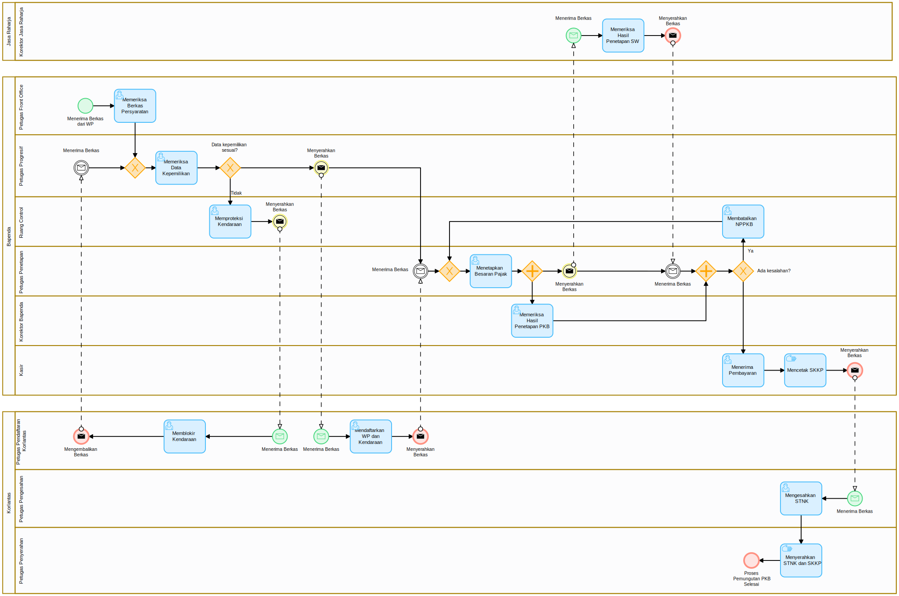
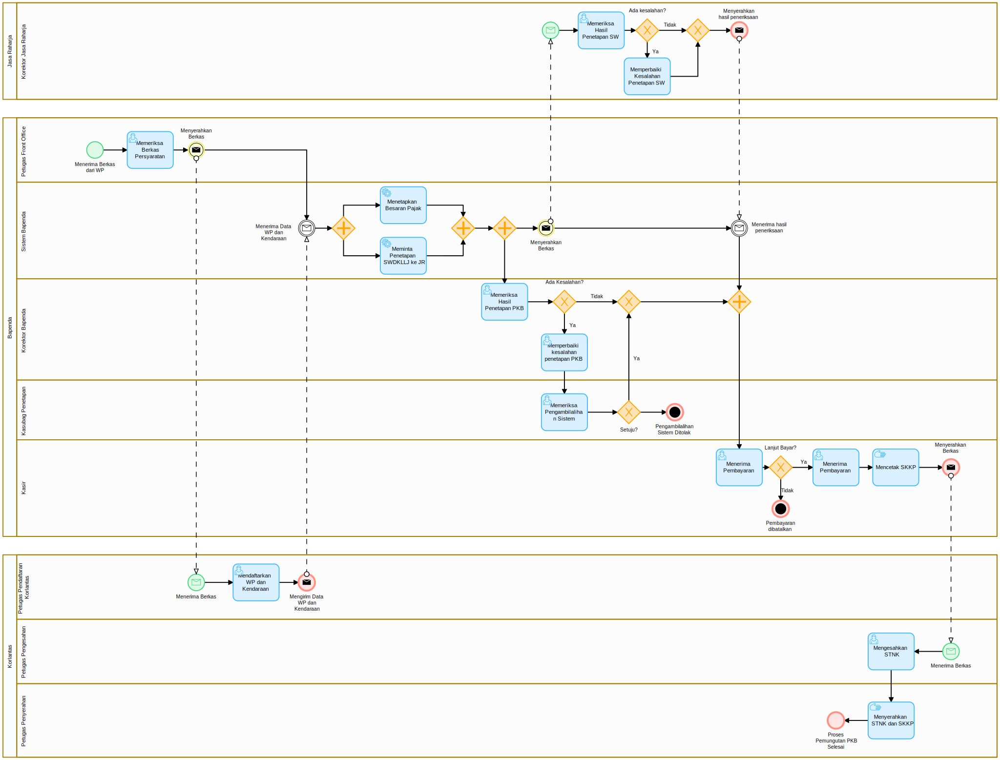
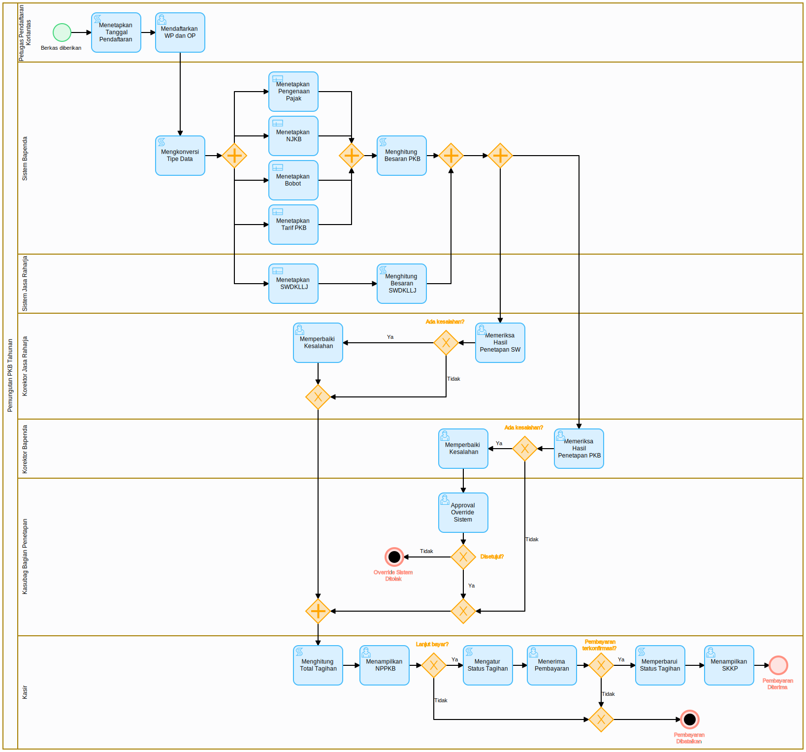

# Thesis
Business Process Automation Using Business Process Management System (Case Study on the Yearly Motor Vehicle Tax Collection Process at Samsat)

Created using [NEXTFLOW](https://nextplatform.ai/product/nextflow) by [NEXTPLATFORM](https://nextplatform.ai/)

## Business Process Model and Notation (BPMN)
### As-Is

### To-Be

### Implementation

## Decision Model and Notation (DMN)
[DMN](dmn)

## Forms
[Form](form)