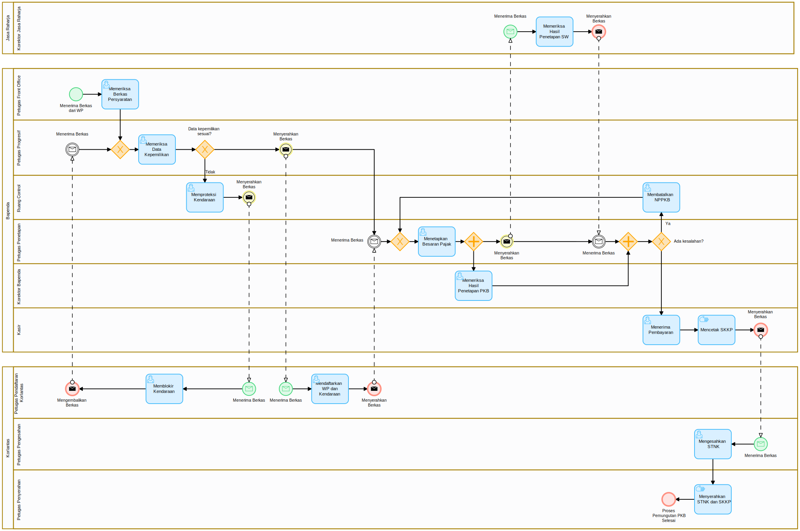
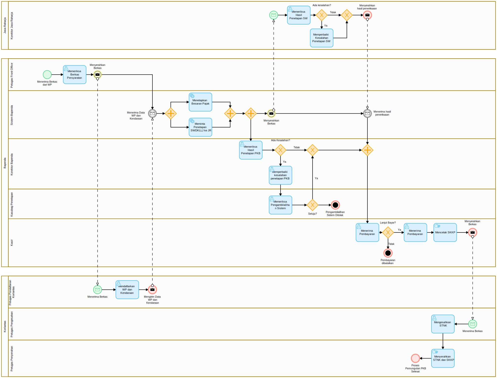
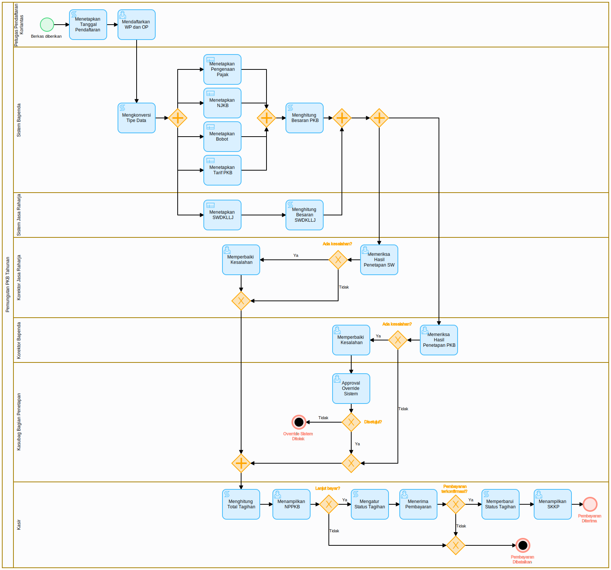
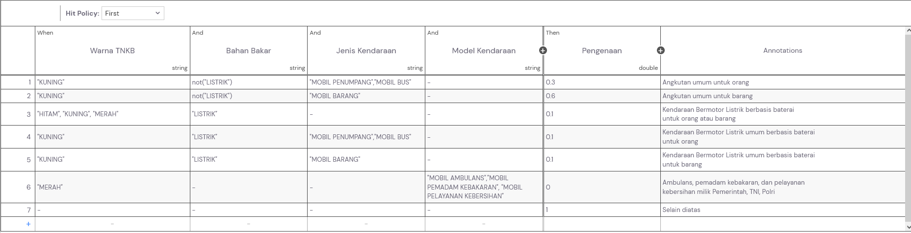
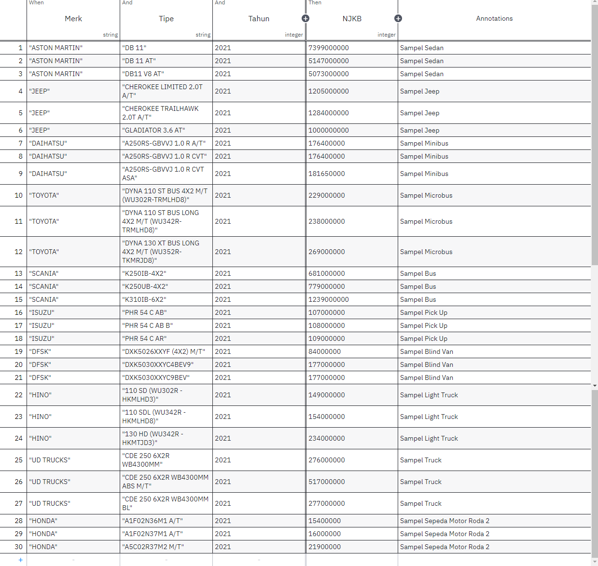
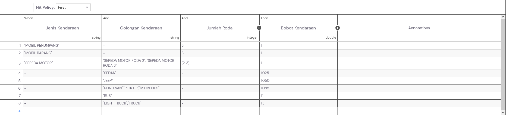
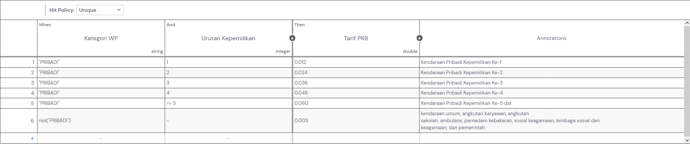
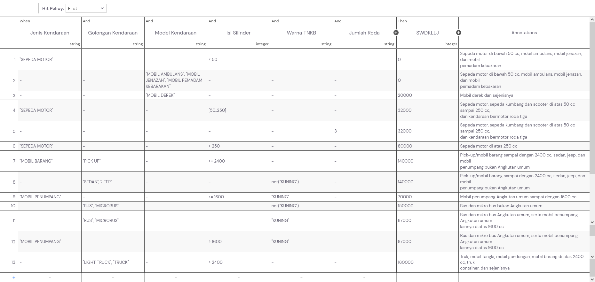

# Undergraduate Thesis
Business Process Automation Using Business Process Management System (Case Study on the Yearly Motor Vehicle Tax Collection Process at Samsat)

Supervisor: Prof. Dr. rer. pol. Hamzah Ritchi, S.E., MBIT., Ak.

Created using [NEXTFLOW](https://nextplatform.ai/product/nextflow) by [NEXTPLATFORM](https://nextplatform.ai/)

## Demo

## Business Process Model and Notation (BPMN)
### As-Is

### To-Be

### Implementation

[Source Code](src/bpmn/)

## Decision Model and Notation (DMN)
### Pengenaan

### NJKB

### Bobot

### Tarif

### SWDKLLJ

[Source Code](src/dmn/)

## Forms
### Initiation

### Registration

### Review NPPKB - PKB

### Review NPPKB - SWDKLLJ

### Revise NPPKB - PKB

### Revise NPPKB - SWDKLLJ

### Approval for System Override

### Show NPPKB

### Payment Confirmation

### Show SKKP

[Source Code](src/form/)

## Test Case
### Permendagri No. 1 Tahun 2021 Pasal 9(1)
.png)

### Permendagri No. 1 Tahun 2021 Pasal 9(3)
.png)

### Permendagri No. 1 Tahun 2021 Pasal 10(1)
.png)

### Permendagri No. 1 Tahun 2021 Pasal 11(1)
.png)

### Permendagri No. 1 Tahun 2021 Pasal 12(1)
.png)

Notes: 
- UU Nomor 1 Tahun 2022 Pasal 10(1), UU Nomor 1 Tahun 2022 Pasal 10(3) & UU Nomor 1 Tahun 2022 Pasal 7(2) is indirectly tested with cases above.
- Process Variable with `null` or `0` value will be shown as empty.
